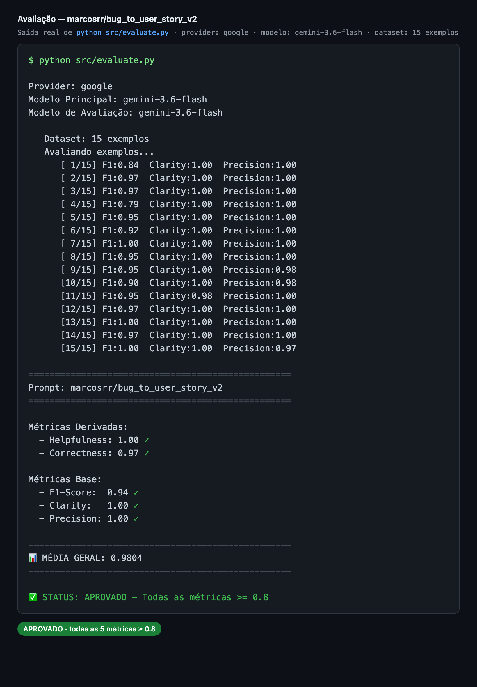

# Pull, Otimização e Avaliação de Prompts com LangChain e LangSmith

Solução do desafio técnico do MBA: fazer **pull** de um prompt de baixa qualidade do
LangSmith Prompt Hub (`leonanluppi/bug_to_user_story_v1`), **otimizá-lo** com técnicas
avançadas de Prompt Engineering, fazer **push** da versão otimizada
(`{seu_username}/bug_to_user_story_v2`, pública) e **avaliá-la** com um LLM-juiz em 5
métricas — todas precisam atingir **≥ 0.8**.

O prompt converte **relatos de bugs → User Stories ágeis** (formato
`Como <papel>, eu quero <objetivo>, para que <benefício>` + Critérios de Aceitação
no estilo Gherkin `Dado / Quando / Então`).

---

## A) Técnicas Aplicadas (Fase 2)

O prompt otimizado ([`prompts/bug_to_user_story_v2.yml`](prompts/bug_to_user_story_v2.yml))
aplica **4 técnicas** de Prompt Engineering:

| Técnica | Por que escolhi | Como apliquei |
|---|---|---|
| **Role Prompting** | Dar ao modelo uma persona especialista aumenta a precisão do vocabulário e do formato ágil, elevando **Clarity** e **Precision**. | Persona explícita: *"Você é um Product Manager sênior, especialista em metodologias ágeis..."* no `system_prompt`. |
| **Few-shot Learning** (obrigatório) | Exemplos concretos de entrada→saída fazem o modelo reproduzir exatamente o formato esperado das `reference`, o que impacta diretamente **F1-Score** e **Clarity**. | 3 exemplos originais (simples, médio e complexo), cada um com par **Entrada:/Saída:**, espelhando o formato do dataset. |
| **Chain of Thought (CoT)** | Análise de bug exige raciocínio (quem/o quê/porquê/critérios). O CoT melhora a **Correctness** ao estruturar o pensamento antes de responder. | Instrução de raciocinar passo a passo **internamente** e responder apenas com a User Story final — evita poluir a saída (o que reduziria Precision/Clarity). |
| **Skeleton of Thought** | Uma estrutura de saída fixa garante consistência e cobertura, essenciais para **F1-Score** (recall) e **Clarity**. | Esqueleto de resposta **adaptativo por complexidade**: simples (story + critérios), médio (+ Contexto Técnico), complexo (seções `=== ... ===`). |

Além das técnicas, o prompt inclui: **regras explícitas de comportamento**, **tratamento
de edge cases** (bug vago → assumir e listar premissas; múltiplos bugs → tratar como
complexo; texto que não é bug → sinalizar) e uso adequado de **System vs User Prompt**
(persona, regras e exemplos no *system*; apenas `{bug_report}` no *user*).

### Por que essas escolhas casam com as métricas
As métricas (`src/metrics.py`) comparam a resposta com a `reference` do dataset:
- **F1-Score** = precisão + recall vs. referência → few-shot + skeleton garantem cobertura e formato.
- **Precision** = ausência de alucinações + coerência factual → regra de "só usar o que o relato afirma".
- **Clarity** = organização, linguagem simples, sem ambiguidade → skeleton + saída enxuta (CoT interno).
- **Helpfulness** = (Clarity + Precision) / 2 e **Correctness** = (F1 + Precision) / 2 — derivadas.

---

## B) Resultados Finais

- **Prompt público (LangChain Hub):** https://smith.langchain.com/hub/marcosrr/bug_to_user_story_v2
- **Projeto de avaliação (LangSmith):** `prompt-optimization-challenge-resolved` — dataset
  `prompt-optimization-challenge-resolved-eval` com 15 exemplos e o tracing de cada execução.
- **Tracing detalhado público (≥ 3 exemplos)** — traces compartilhados publicamente,
  um de cada nível de complexidade (mostram o `bug_report` de entrada, a User Story
  gerada pelo `gemini-3.6-flash` e as notas do juiz):
  - **Simples** (bug do carrinho): https://smith.langchain.com/public/30aa66e7-81e8-4fe1-b3df-13ec5960e561/r
  - **Médio** (relatório de vendas lento): https://smith.langchain.com/public/3981884d-a670-432b-b3d9-eedd7767648e/r
  - **Complexo** (checkout com múltiplas falhas): https://smith.langchain.com/public/425a1bf8-bed8-49b1-a3ef-a2ddb7df0e02/r
- **Screenshots das avaliações (todas ≥ 0.8):** na pasta [`docs/`](docs/):

| # | Arquivo | O que mostra |
|---|---|---|
| 1 | [`docs/01-avaliacao-metricas.png`](docs/01-avaliacao-metricas.png) | Saída do `evaluate.py`: 15 exemplos + 5 métricas ≥ 0.8, média 0.9804, **APROVADO** |
| 2 | [`docs/02-trace-simples.png`](docs/02-trace-simples.png) | Trace de bug **simples** (carrinho): entrada → User Story |
| 3 | [`docs/03-trace-medio.png`](docs/03-trace-medio.png) | Trace de bug **médio** (relatório lento): com "Contexto Técnico" |
| 4 | [`docs/04-trace-complexo.png`](docs/04-trace-complexo.png) | Trace de bug **complexo** (checkout): seções `=== ... ===` |
| 5 | [`docs/05-langsmith-projeto-traces.png`](docs/05-langsmith-projeto-traces.png) | Projeto no LangSmith com todas as execuções e notas do juiz |
| 6 | [`docs/06-prompt-publico-hub.png`](docs/06-prompt-publico-hub.png) | Prompt **público** no Hub com tags/técnicas e system prompt |



> Os links de trace acima são **Shared URLs públicas** do LangSmith (qualquer pessoa com
> o link vê o trace). Para gerar novas: abra um trace no projeto e use o ícone **Share**.

### Tabela comparativa: v1 (ruim) vs v2 (otimizado)

| Métrica | v1 (ilustrativo) | v2 (obtido) | Meta |
|---|---|---|---|
| Helpfulness | 0.45 ✗ | **1.00** ✓ | ≥ 0.8 |
| Correctness | 0.52 ✗ | **0.97** ✓ | ≥ 0.8 |
| F1-Score | 0.48 ✗ | **0.94** ✓ | ≥ 0.8 |
| Clarity | 0.50 ✗ | **1.00** ✓ | ≥ 0.8 |
| Precision | 0.46 ✗ | **1.00** ✓ | ≥ 0.8 |
| **Média geral** | — | **0.9804** | ≥ 0.8 |

**STATUS: ✅ APROVADO** — todas as 5 métricas ≥ 0.8 (média 0.9804).
Modelo usado (responder + juiz): `gemini-3.6-flash`. Avaliação sobre os 15 exemplos do
dataset. *(Os números de v1 são os ilustrativos do enunciado.)*

### Registro da jornada de otimização (iterações)
| Iteração | Ajuste principal | Resultado |
|---|---|---|
| 1 | Persona (Role) + formato Gherkin + Few-shot (3 exemplos simples/médio/complexo) + Skeleton adaptativo + CoT interno + regras de precisão/cobertura | **APROVADO** — média 0.9804, todas ≥ 0.8 |

> A estratégia foi concentrar todas as técnicas já na primeira versão do `v2.yml`,
> ancorando o formato de saída **exatamente** nas `reference` do dataset (formato
> `Como/quero/para que` + `Dado/Quando/Então`, com seções `=== ... ===` nos bugs
> complexos) e mantendo o raciocínio (CoT) **interno** para não poluir a saída — o que
> preserva Clarity e Precision. Com isso, todas as métricas passaram de primeira.
> Ajuste operacional necessário: o modelo `gemini-2.5-flash` foi descontinuado para novos
> usuários, então trocamos para `gemini-3.6-flash` no `.env`.

---

## C) Como Executar

### Pré-requisitos
- Python 3.9+
- Conta no [LangSmith](https://smith.langchain.com) (API key + username do Hub)
- API key do provider de LLM escolhido:
  - **Gemini (free):** https://aistudio.google.com/app/apikey  *(padrão deste projeto)*
  - **OpenAI (pago, ~$1–5):** https://platform.openai.com/api-keys

### 1. Ambiente virtual e dependências
```bash
python3 -m venv venv
source venv/bin/activate      # Windows: venv\Scripts\activate
pip install -r requirements.txt
```

### 2. Configurar credenciais
Copie o template e preencha suas chaves:
```bash
cp .env.example .env
```
Edite o `.env`:
```
LANGSMITH_API_KEY=<sua_api_key_langsmith>
LANGSMITH_PROJECT=prompt-optimization-challenge-resolved
USERNAME_LANGSMITH_HUB=<seu_username_no_hub>
GOOGLE_API_KEY=<sua_api_key_gemini>

LLM_PROVIDER=google
LLM_MODEL=gemini-3.6-flash
EVAL_MODEL=gemini-3.6-flash
```
> **Modelos:** nomes de modelos do Gemini mudam com frequência e alguns são
> descontinuados. Este projeto usa `gemini-3.6-flash` (o `gemini-2.5-flash` foi
> descontinuado para novos usuários). Para ver os modelos disponíveis na sua conta:
> ```bash
> python -c "import os,google.generativeai as g; from dotenv import load_dotenv; load_dotenv(); g.configure(api_key=os.getenv('GOOGLE_API_KEY')); [print(m.name) for m in g.list_models() if 'generateContent' in m.supported_generation_methods]"
> ```
> Para descobrir o `USERNAME_LANGSMITH_HUB`: publique qualquer prompt no Hub, abra-o e
> clique no ícone de cadeado (🔒). Para usar OpenAI, troque as 3 últimas linhas pelas
> equivalentes comentadas no `.env.example` e preencha `OPENAI_API_KEY`.

### 3. Rodar cada fase
```bash
# (Fase 1) Pull do prompt ruim -> salva prompts/bug_to_user_story_v1.yml
python src/pull_prompts.py

# (Fase 3) Push do prompt otimizado (público) -> {seu_username}/bug_to_user_story_v2
python src/push_prompts.py

# (Fase 3) Avaliação: puxa o v2 do Hub, roda contra os 15 exemplos e calcula as 5 métricas
python src/evaluate.py

# (Fase 5) Testes de validação do prompt
pytest tests/test_prompts.py -v
```

### 4. Iterar até aprovar
Se alguma métrica ficar < 0.8, ajuste [`prompts/bug_to_user_story_v2.yml`](prompts/bug_to_user_story_v2.yml),
rode `push_prompts.py` de novo e reavalie. Use o **Tracing** do LangSmith para inspecionar
as respostas. *(Gemini free tem rate limits — se aparecer erro 429, aguarde e reexecute.)*

---

## Estrutura do projeto
```
├── prompts/
│   ├── bug_to_user_story_v1.yml   # prompt inicial (regenerado pelo pull)
│   └── bug_to_user_story_v2.yml   # prompt otimizado (entrega)
├── datasets/
│   └── bug_to_user_story.jsonl    # 15 exemplos (não alterar)
├── src/
│   ├── pull_prompts.py            # pull do Hub  (implementado)
│   ├── push_prompts.py            # push ao Hub  (implementado)
│   ├── evaluate.py                # avaliação    (pronto — não alterar)
│   ├── metrics.py                 # 5 métricas   (pronto — não alterar)
│   └── utils.py                   # utilitários  (pronto — não alterar)
└── tests/
    └── test_prompts.py            # 6 testes     (implementado)
```

## Arquitetura em uma frase
`pull_prompts.py` traz o v1 do Hub → editamos `bug_to_user_story_v2.yml` →
`push_prompts.py` monta um `ChatPromptTemplate` (System + User com `{bug_report}`) e o
publica público no Hub → `evaluate.py` puxa o v2, roda contra o dataset e um LLM-juiz
pontua F1/Clarity/Precision (Helpfulness e Correctness são derivadas).
